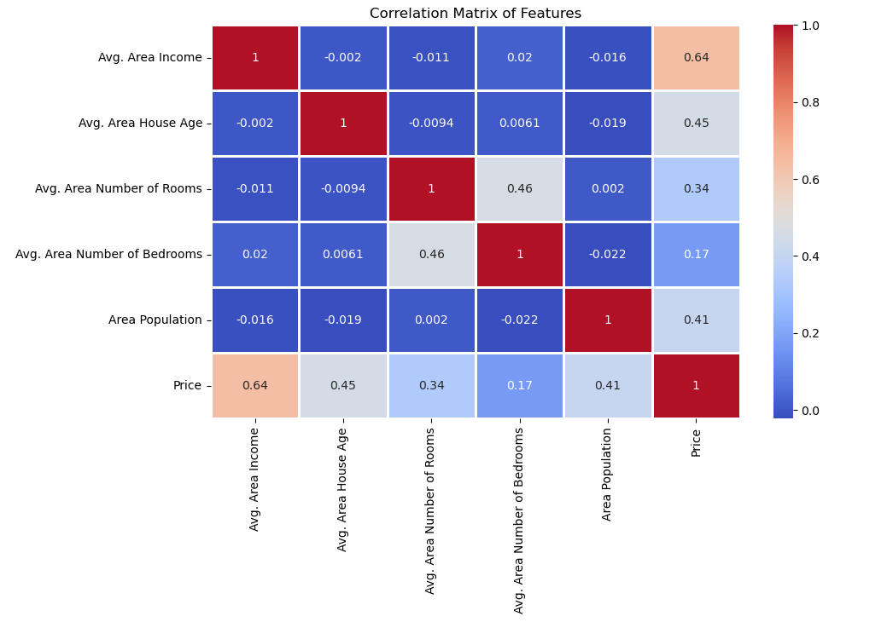
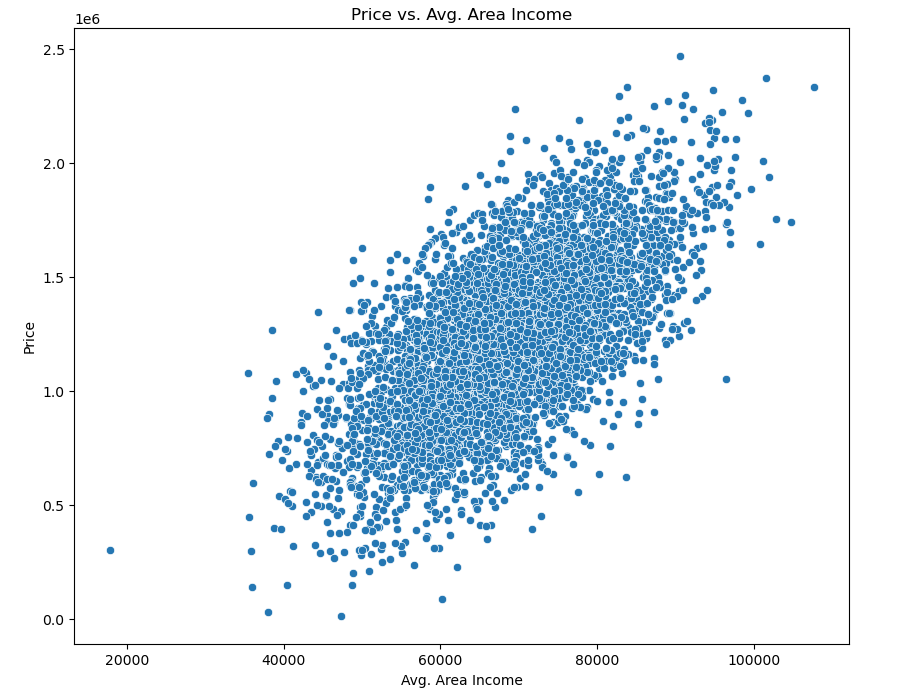
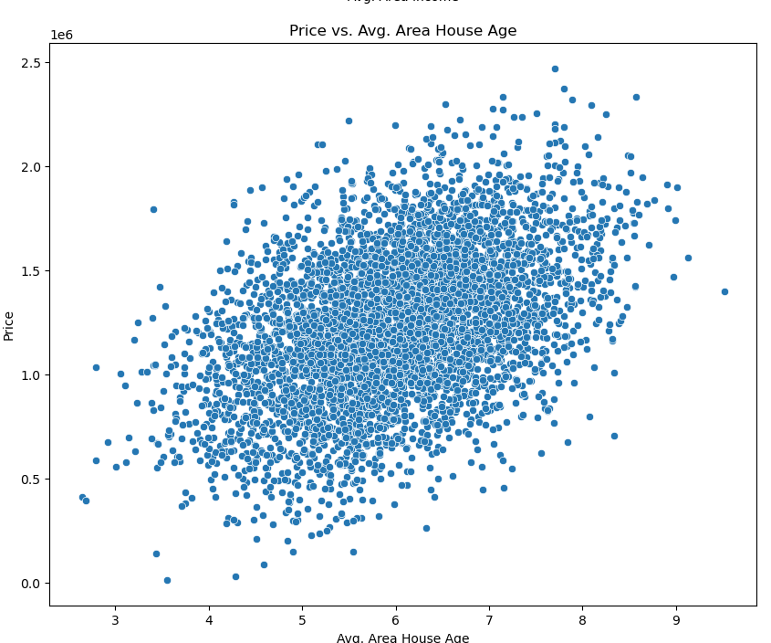
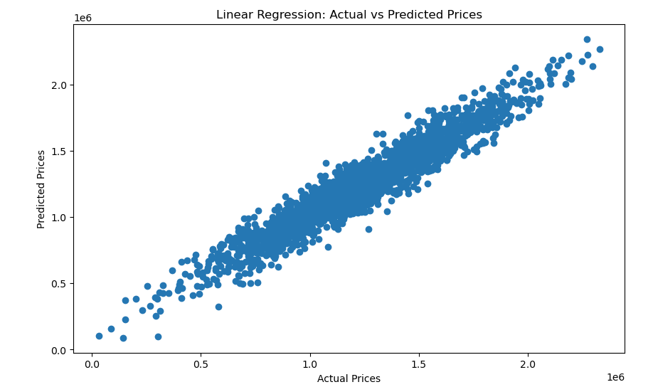
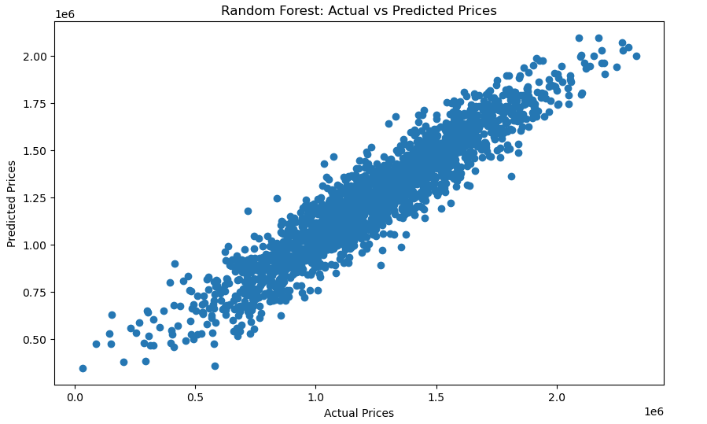

# House Price Prediction Machine Learning Project

This project aims to predict house prices using machine learning models. It includes data preprocessing, model training, evaluation, and visualization.

## Project Structure
```bash
House_Price_Prediction/
│
├── src/
│   ├── __init__.py                  # Initializes the package
│   ├── main.py                      # Entry point for data processing, model training, and evaluation
│   ├── preprocessing.py             # Handles data preprocessing
│   ├── model.py                     # Defines and trains the models
│   ├── evaluation.py                # Evaluates model performance
│
├── data/
│   └── USA_Housing.csv              # Dataset for house price prediction
│
├── models/
│   ├── lr_model.pkl                 # Trained Linear Regression model
│   └── rf_model.pkl                 # Trained Random Forest model
│
├── notebooks/
│   └── House_Price_Prediction_Visualization.ipynb  # Jupyter notebook for data visualization
│
├── images/
│   ├── correlation_matrix.png       # Correlation matrix heatmap
│   ├── LinearRegResult.png          # Linear Regression model performance result
│   ├── RandomForestResult.png       # Random Forest model performance result
│   ├── scatter_age.png              # Scatter plot: Price vs. Avg. Area House Age
│   └── scatter_income.png           # Scatter plot: Price vs. Avg. Area Income
│
├── README.md                       # Project documentation
├── requirements.txt                # Project dependencies
├── LICENSE.txt                     # Project license
└── .gitignore                      # Files to ignore in Git

# End of directory structure
```

## Data Visualization

### Correlation Matrix Heatmap


### Scatter Plots
- **Price vs. Avg. Area Income**
  

- **Price vs. Avg. Area House Age**
  

### Model Performance Comparison
- **Linear Regression Model Performance**
  

- **Random Forest Model Performance**
  

## Usage
1. **Load the Dataset**: Ensure the dataset `USA_Housing.csv` is present in the `data/` folder.
2. **Preprocess the Data**: The `preprocessing.py` script in the `src/` folder handles data preprocessing. Make sure this script is correctly implemented and accessible.
3. **Run the Notebook**: Open the `House_Price_Prediction_Visualization.ipynb` file in Jupyter Notebook or JupyterLab and execute the cells to view the visualizations and analyses.

## Notebook Highlights
1. **Data Overview**
   - **Loading Data**: The dataset is loaded, and basic information is displayed.
   - **Summary Statistics**: Summary statistics provide insights into the dataset’s features.

2. **Correlation Matrix**
   - **Visualization**: A heatmap shows correlations between numeric features and house prices.
   - **Key Observations**:
     - Avg. Area Income: Strong positive correlation (0.64) with house prices.
     - Avg. Area House Age: Moderate positive correlation (0.45).
     - Avg. Area Number of Rooms: Moderate positive correlation (0.34).
     - Area Population: Moderate positive correlation (0.41).

3. **Scatter Plots**
   - **Price vs. Avg. Area Income**: Shows a clear positive correlation with most points following an upward trend.
   - **Price vs. Avg. Area House Age**: Displays a moderate positive relationship.
   - **Price vs. Avg. Area Number of Rooms**: Shows vertical clusters indicating moderate correlation.
   - **Price vs. Area Population**: Suggests a moderate positive relationship with scattered points.

4. **House Price Distribution**
   - **Histogram**: Displays the distribution of house prices.
   - **Interpretation**:
     - Prices are roughly normally distributed with a central tendency around $1.15 million.
     - Most prices fall between $600,000 and $1.7 million.
     - There is a slight positive skew (right tail) with fewer extremely high-priced homes.

## Results
The notebook provides insights into feature relationships and the distribution of house prices. These visualizations help in understanding the data and guiding feature selection for predictive modeling.

## Contributing
Contributions to this project are welcome! Please fork the repository, make your changes, and submit a pull request.

## License
This project is licensed under the MIT License. See the `LICENSE.txt` file for details.

## Acknowledgements
- Thanks to the Pandas library for data manipulation.
- Thanks to Matplotlib and Seaborn for visualization tools.


## Contact

For any questions or feedback, feel free to contact me at [mans.aghabeig@gmail.com](mailto:mans.aghabeig@gmail.com).
